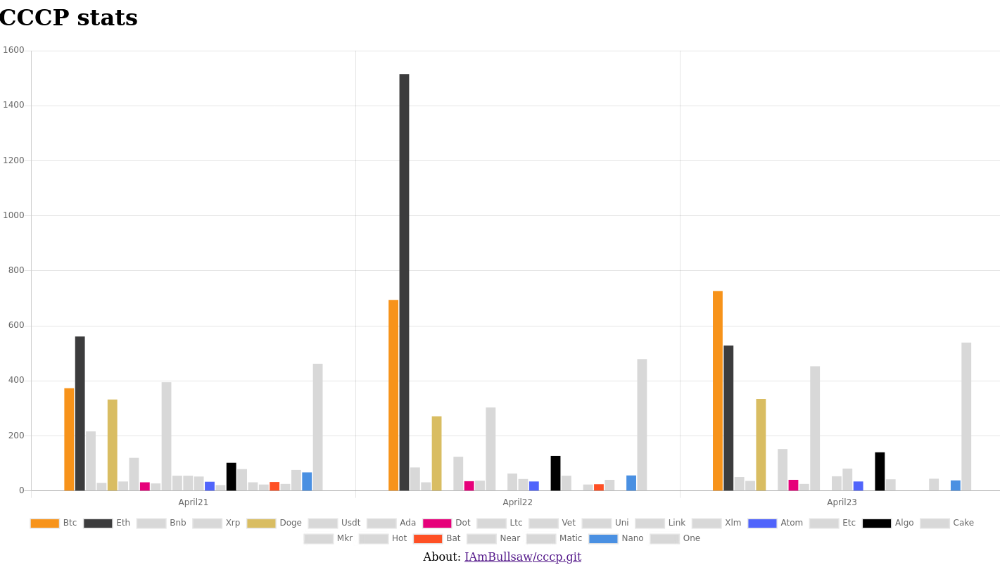

# CryptoCurrency Comment Parser

Simple script and bot which finds the daily thread on `reddit.com/r/cryptocurrency` and counts the number of times a coin defined in `coins.txt` has been mentionen in a comment.
My idea is that this is a basic and very crude indication of popularity, coin shilling and/or current rockets which could be used as a data point for desicions regarding investments.



## Caveats

* coin names like `one` are very likely to have skewed data, since it is a common word
* no regards to upvote/downvote or if the coin is mentioned in a positive/negative manner are taken

## Installing

To install, the easiest is to create a new virtual environment and install the dependencies listen in `requirements.txt`:

```bash
./cccp $ python3 -m venv .venv
./cccp $ source .venv/bin/activate
(.venv) ./cccp $ pip3 install -r requirements.txt
```

or by running the `./install.sh` script in the root repo.

Then you must create and update a `praw.ini` file created in `cccp/src` with your reddit app/bots `client_secret` and `client_id`, as well as `user_agent`:

```
# ... other file contents above here...
client_id=
client_secret=
user_agent=
```

## Running the cccp.py script

You run cccp it with `src` as the working directory:

```bash
cccp/src $ chmod +x cccp.py
cccp/src $ ./cccp.py
Parsing comments for coins ...
Expanding 7995 comments    ->
          513.0023 seconds <-
```

And the results are saved in `cccp/src/result.json`

## Running the generate.py script

This script reads from `result.js` to create the `CccpChart.py` which is the chart used by pychart.js  
Typically you'd like to run this after updating result.js with the cccp.py

## Running the flask server

To look at the gathered data a little easier, run the flask server via `flask run` from `cccp/src/` and go to `localhost:5000`.

## Example praw.ini

Up the user agent version if you encounter issues with it being blocked...

```ini
[DEFAULT]
# A boolean to indicate whether or not to check for package updates.
check_for_updates=True

# Object to kind mappings
comment_kind=t1
message_kind=t4
redditor_kind=t2
submission_kind=t3
subreddit_kind=t5
trophy_kind=t6

# The URL prefix for OAuth-related requests.
oauth_url=https://oauth.reddit.com

# The amount of seconds of ratelimit to sleep for upon encountering a specific type of 429 error.
ratelimit_seconds=5

# The URL prefix for regular requests.
reddit_url=https://www.reddit.com

# The URL prefix for short URLs.
short_url=https://redd.it

# The timeout for requests to Reddit in number of seconds
timeout=16

[bot1]
client_id=
client_secret=
user_agent=CCCPAgent 0.1
```

## run.sh example

Example of a `run.sh` file, which could be used as an entrypoint to run cccp.py as a cron job. It's ignored by git and should probably not be versioned.

```bash
source absolute/path/to/.venv/bin/activate &&
cd absolute/path/to/cccp/src &&
./cccp.py
```
